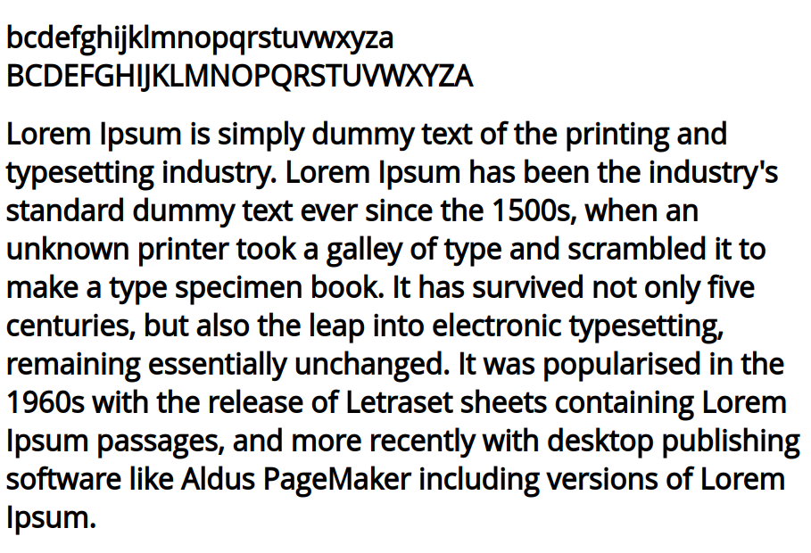

# shiftrr
small python script to shift things up

# phish.py <input TTF file> <input text file> <output filename> <n of shifts>
The script:
  * shifts N number of times all the ascii chars from the input file. 
  * shifts the same number of time all the ascii chars from the cmap section of the TTF file so that when the shifted output text is used with the new TTF file, the text will look like the same original text. 
 
 Example:
 
 test file
 ```
 Lorem Ipsum is simply dummy text of the printing and typesetting industry. Lorem Ipsum has been the industry's standard dummy text ever since the 1500s, when an unknown printer took a galley of type and scr
ambled it to make a type specimen book. It has survived not only five centuries, but also the leap into electronic typesetting, remaining essentially unchanged. It was popularised in the 1960s with the rele
ase of Letraset sheets containing Lorem Ipsum passages, and more recently with desktop publishing software like Aldus PageMaker including versions of Lorem Ipsum.
 ```
 Downloaded OpenSans-Regular.ttf for this poc
 
 python phish.py /home/XXX/Downloads/OpenSans-Regular.ttf test new.ttf 1
 
 The test file now looks like the following:
 ```
Knqdl Hortl hr rhlokx ctllx sdws ne sgd oqhmshmf zmc sxodrdsshmf hmctrsqx. Knqdl Hortl gzr addm sgd hmctrsqx'r rszmczqc ctllx sdws dudq rhmbd sgd 1500r, vgdm zm tmjmnvm oqhmsdq snnj z fzkkdx ne sxod zmc rbqzlakdc hs sn lzjd z sxod rodbhldm annj. Hs gzr rtquhudc mns nmkx ehud bdmstqhdr, ats zkrn sgd kdzo hmsn dkdbsqnmhb sxodrdsshmf, qdlzhmhmf drrdmshzkkx tmbgzmfdc. Hs vzr onotkzqhrdc hm sgd 1960r vhsg sgd qdkdzrd ne Kdsqzrds rgddsr bnmszhmhmf Knqdl Hortl ozrrzfdr, zmc lnqd qdbdmskx vhsg cdrjsno otakhrghmf rnesvzqd khjd Zkctr OzfdLzjdq hmbktchmf udqrhnmr ne Knqdl Hortl.
```
We can include that in the following test html and simply open it on the browser to confirm that our text is looking as expected. 
```
<!DOCTYPE html>
<html>
<head>
<style> 
@font-face {
   font-family: myFirstFont;
   src: url('new.ttf');
}

* {
   font-family: myFirstFont;
}

</style>
</head>
<body>

<h1>abcdefghijklmnopqrstuvwxyz ABCDEFGHIJKLMNOPQRSTUVWXYZ</h1>
<h1>Knqdl Hortl hr rhlokx ctllx sdws ne sgd oqhmshmf zmc sxodrdsshmf hmctrsqx. Knqdl Hortl gzr addm sgd hmctrsqx'r rszmczqc ctllx sdws dudq rhmbd sgd 1500r, vgdm zm tmjmnvm oqhmsdq snnj z fzkkdx ne sxod zmc rbqzlakdc hs sn lzjd z sxod rodbhldm annj. Hs gzr rtquhudc mns nmkx ehud bdmstqhdr, ats zkrn sgd kdzo hmsn dkdbsqnmhb sxodrdsshmf, qdlzhmhmf drrdmshzkkx tmbgzmfdc. Hs vzr onotkzqhrdc hm sgd 1960r vhsg sgd qdkdzrd ne Kdsqzrds rgddsr bnmszhmhmf Knqdl Hortl ozrrzfdr, zmc lnqd qdbdmskx vhsg cdrjsno otakhrghmf rnesvzqd khjd Zkctr OzfdLzjdq hmbktchmf udqrhnmr ne Knqdl Hortl.</h1>
</body>
</html>
```


